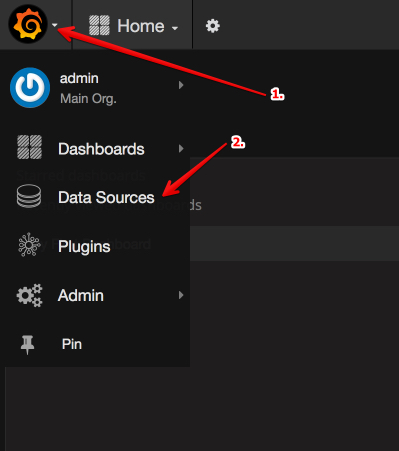
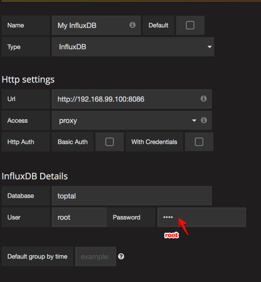
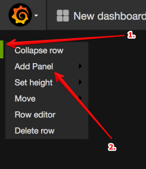

This is test project for using Grafana together with InfluxDB all wrapped in
Docker containers.

# Getting started

* Check out this repo
* In the same folder as **docker-compose.yml**:
```
docker-compose up -d  
```
(if this command fails try first to execute: ``docker-compose build``)
* Two containers should be up and running. Check this out with:
```
docker ps -a
```

* Get ip address of docker machine
```
docker-machine ip default
```
* Populate InfluxDB with test data.
If your docker ip address is different than one specified in **populate.rb**, update value in that file.
```
ruby populate.rb
```
* Open Grafana in browser:
```
$ docker-machine ip default
-> 192.168.99.100
$ firefox 192.168.99.100:3000
```

* Login with username **admin**, password **admin**.

* Add data source



* Click **Add data source**

* Populate as on the picture below:



* Add new Dashboard.
**Dashboards** -> **New**

* Add new Graph to the row
**Add Panel** -> **Graph**


* Save Dashboard

# Links
* [Data-only container madness](http://container42.com/2014/11/18/data-only-container-madness/?__hstc=137489263.4c721174945a7133d69068a5ec347cb0.1476004333582.1476004333582.1476004333582.1&__hssc=137489263.1.1476004333582&__hsfp=2534859043)
* [Docker In-depth: Volumes](http://container42.com/2014/11/03/docker-indepth-volumes/?__hstc=137489263.4c721174945a7133d69068a5ec347cb0.1476004333582.1476004333582.1476004333582.1&__hssc=137489263.1.1476004333582&__hsfp=2534859043)
* [Docker Volumes and Networks with Compose](https://www.linux.com/learn/docker-volumes-and-networks-compose)
* [Docker, Grafana, InfluxDB Tutorial](http://davidanguita.name/articles/simple-data-visualization-stack-with-docker-influxdb-and-grafana/)
* [Graphana tutorial](https://www.youtube.com/watch?v=sKNZMtoSHN4&index=7&list=PLDGkOdUX1Ujo3wHw9-z5Vo12YLqXRjzg2)

# Final notes

Tested on:

Docker version 1.12.0, build 8eab29e  
docker-compose version 1.8.0, build f3628c7  
docker-py version: 1.9.0  
CPython version: 2.7.9  
OpenSSL version: OpenSSL 1.0.2h  3 May 2016  
OS X El Capitan 10.11.3
